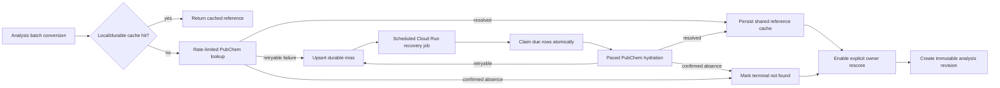

# Durable Chemical Reference Recovery Design

**Date:** 2026-08-13  
**Status:** Approved for planning  
**Decision:** Persist recoverable PubChem misses in Supabase, hydrate them through a scheduled Cloud Run job, and require an explicit user-triggered rescore that creates a new analysis revision.

## Problem

The chemistry service currently resolves all uncached chemicals concurrently. One analysis can fan out to property, density, and GHS PubChem calls at once. PubChem dynamically throttles this traffic and returned HTTP 503 for several valid chemicals, including 4-bromoanisole and phenylboronic acid.

On a lookup failure, the service calls `cache.add_missing()`, which stores a name only in the Cloud Run container's `/tmp` directory. That state is not durable, is not consumed by a deployed worker, and cannot make an analysis eligible for recovery. The UI consequently claims a miss was queued and can be rerun even though neither is true.

The app has an existing `/api/rescore` path and a result-page regrade control. It recomputes scores from accepted recommendations, but currently trusts browser-supplied analysis data and replaces the client-held score block rather than creating an explicit recovery revision.

## Goals

1. Avoid PubChem request bursts and recover transient API failures without extending user-facing analysis latency indefinitely.
2. Persist all retryable and terminal reference misses durably with bounded, non-sensitive diagnostics.
3. Hydrate recovered records into a durable shared reference store through an independently scheduled worker.
4. Preserve scientific provenance: a saved analysis does not change automatically when new data arrives.
5. Let a signed-in owner explicitly create a rescore revision that incorporates accepted swaps and recovered reference data.
6. Represent permanent/not-found records honestly and never claim queueing unless enqueue succeeds.

## Non-goals

- No automatic modification of saved analyses.
- No automatic rerun of LLM recommendation generation.
- No PubChem API-key integration. PUG-REST does not offer keys or allowlists that bypass dynamic throttling.
- No use of Vercel cron/API routes as the recovery worker.

## Architecture

### Durable miss queue

Create `gpc_chemical_reference_misses`, one row per normalized chemical identity:

| Field | Purpose |
| --- | --- |
| `id` | Queue-row primary key. |
| `normalized_name` | Canonical lowercase identity; unique. |
| `display_name` | Latest human-readable spelling for UI/operations. |
| `status` | `pending`, `retrying`, `resolved`, or `terminal_not_found`. |
| `attempt_count` | Number of remote hydration attempts. |
| `next_attempt_at` | Scheduler eligibility; makes retry timing durable. |
| `last_http_status` | Bounded operational signal such as 503 or 404. |
| `last_error_code` | Enumerated safe code, never an exception body. |
| `first_seen_at`, `last_seen_at` | Demand and age audit fields. |
| `resolved_at` | Time a shared record became available or terminal. |
| `locked_at`, `locked_by` | Worker-claim lease fields. |

The request path upserts a retryable miss after a final bounded failure. Repeated analyses update `last_seen_at` and may bring a due record forward; they never create duplicates. Confirmed PubChem 404s transition to `terminal_not_found` and are not retried automatically.

The service uses an owner-independent, service-role-only RPC for enqueue and worker claiming. Browser clients cannot write, alter, or view operational queue rows directly.

### Foreground PubChem client

The chemistry service adds one process-wide async limiter shared by property, density, and GHS calls. It allows no more than two outbound PubChem requests per second, including nested calls. A conversion request also has bounded internal concurrency; the batch endpoint no longer launches unbounded live lookups with `asyncio.gather()`.

For HTTP 429, 503, 504, DNS, and connection-timeout failures, retry with capped exponential backoff and full jitter. Read `X-Throttling-Control`; Yellow/Red/Black lowers the limiter's effective rate for subsequent requests. A lookup has a strict foreground deadline, after which it enqueues recovery and returns the partial/unavailable result. An HTTP 404 is a confirmed absence rather than retryable.

A successful live lookup and a successful worker lookup both write through to the shared durable reference cache. Container-local `/tmp` state is not used as the source of truth for misses or references.

### Scheduled recovery worker

Use a separate Cloud Run Job invoked by Cloud Scheduler with an authenticated trigger. It has no public endpoint and no user-facing request deadline. Each invocation:

1. Claims a small due batch using a transactional Supabase RPC that sets a lease.
2. Hydrates one chemical at a time through the same paced PubChem client.
3. Writes complete successful records to the durable reference store/cache.
4. Marks rows `resolved`, `terminal_not_found`, or reschedules them with durable capped exponential backoff.
5. Emits structured counts only: claimed, resolved, retryable, terminal, and rate-throttle observations.

The worker is idempotent. Lease expiry allows recovery after a job crash. It does not rescore analyses or invoke LLMs.

### Explicit rescore revision

Recovery changes data availability, not prior scientific output. On a result page, the owner sees a recovery state based on the analysis's unresolved chemical identities:

- pending/retrying: `Reference retrieval pending` with names; rescore remains disabled for recovery-only updates;
- all relevant rows resolved or terminal: show `Re-score with recovered reference data`;
- accepted recommendations also exist: `Re-score with accepted changes and recovered data`.

The rescore request accepts an analysis ID and expected revision number, not an authoritative analysis object. The route loads the owned analysis from Supabase, applies recorded accepted decisions, runs batch conversion/scoring, and creates a new immutable revision using the established analysis revision model. It stores source revision, queue-status snapshot, resolved/terminal identity set, score output, and rescore reason. It never overwrites the previous analysis or acceptance history.

A current control labelled `Re-grade with accepted changes` is retained only as a specialized label when no recovery state is relevant. The UI displays failed request errors rather than silently doing nothing.

### Accurate availability disclosure

The analysis result records `unresolvedChemicals` from actual converter outcomes and adds a queue-status summary only after a successful durable upsert. The UI must distinguish:

- **Retrieval pending:** transient miss was durably queued.
- **Reference unavailable:** terminal record absent or no durable queue action succeeded.
- **Recovered data available:** owner can create an explicit rescore revision.

It must not promise automatic rerun, silently insert data, or imply that all chemistry properties were recovered when only partial records exist.

## Database and access controls

- Migration creates the queue table, state/timestamp constraints, indexes for due claims and normalized name, and RLS enabled with no browser policies.
- `SECURITY DEFINER` functions use a fixed `search_path`, validate every state transition, lock rows during claim, and return typed narrow results.
- Only the server's admin client/service role invokes enqueue, claim, complete, and query-status functions.
- A queue row stores chemical identity and bounded provider status; no protocol text, user identifiers, raw external responses, or exception text.

## Test contracts

1. A batch containing many uncached chemicals cannot exceed the configured PubChem rate or conversion concurrency.
2. A 503 uses delayed capped exponential backoff; it never performs immediate retry bursts.
3. PubChem throttle headers reduce rate appropriately.
4. Retryable failures create one durable deduplicated queue row; 404 creates terminal state.
5. Queue rows survive service restart and a second worker cannot claim an active lease.
6. A crashed worker's expired lease is reclaimable.
7. Successful worker hydration writes a shared cache record and transitions the miss to `resolved`.
8. Rescore loads owned server-side analysis, applies accepted choices, requires expected revision, and creates a new immutable revision.
9. An old score and its decision history remain unchanged after a recovery rescore.
10. UI labels/button states match pending, resolved, and terminal miss states and surface request errors.

## Operations

- Configure Cloud Scheduler to invoke the private Cloud Run Job with a dedicated scheduler service account.
- Give the job runtime only required Secret Manager access and the current Supabase server credential; use a separate deployment identity.
- Monitor job success rate, due queue age, attempts-to-resolution, PubChem 503/throttle counts, and terminal-not-found rate.
- Alert on queue age above the agreed recovery target or repeated job failure; do not alert per individual chemical miss.

## Acceptance criteria

- PubChem traffic is rate-limited and retryable transient failures are not lost.
- `gpc_chemical_reference_misses` is the durable authoritative miss ledger.
- A scheduled, private Cloud Run Job hydrates due entries, persists results, and safely resumes after failure.
- The UI makes no false queue/re-run claim.
- Owners can manually create a new rescore revision after data is recovered while retaining their accepted/rejected decisions and the prior analysis unchanged.
- Terminal misses remain disclosed and cannot masquerade as recovered data.
